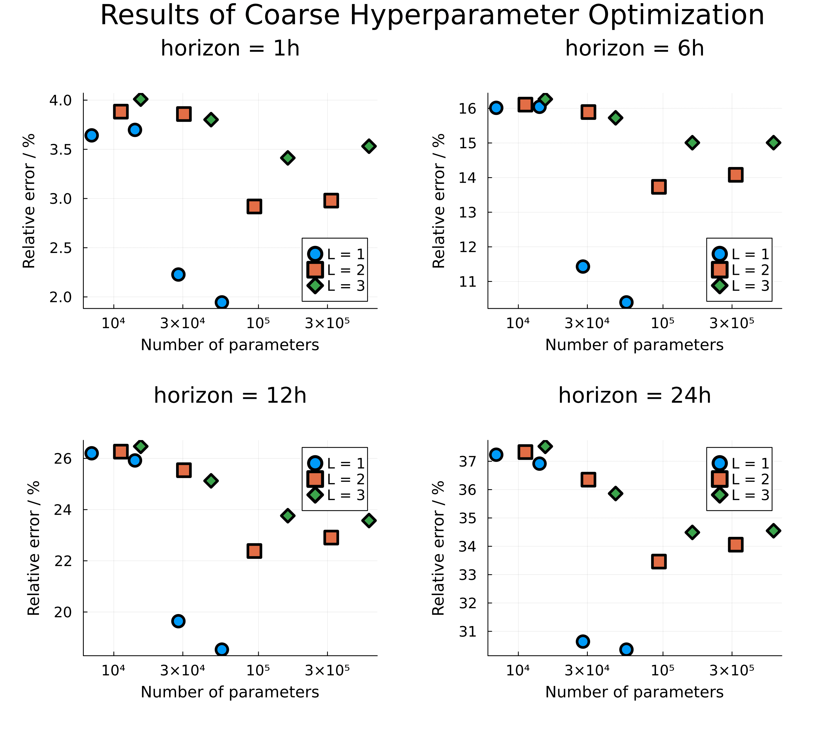
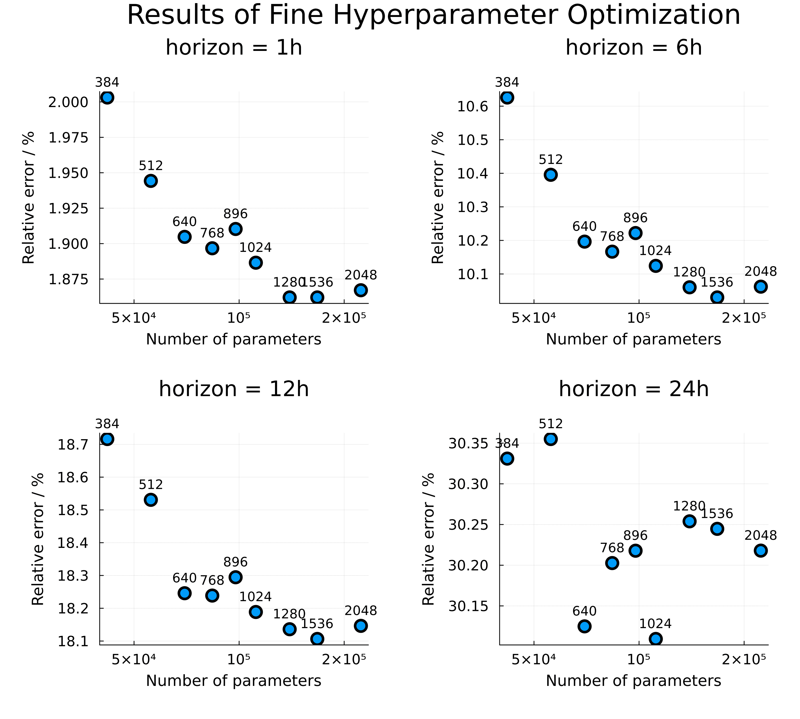
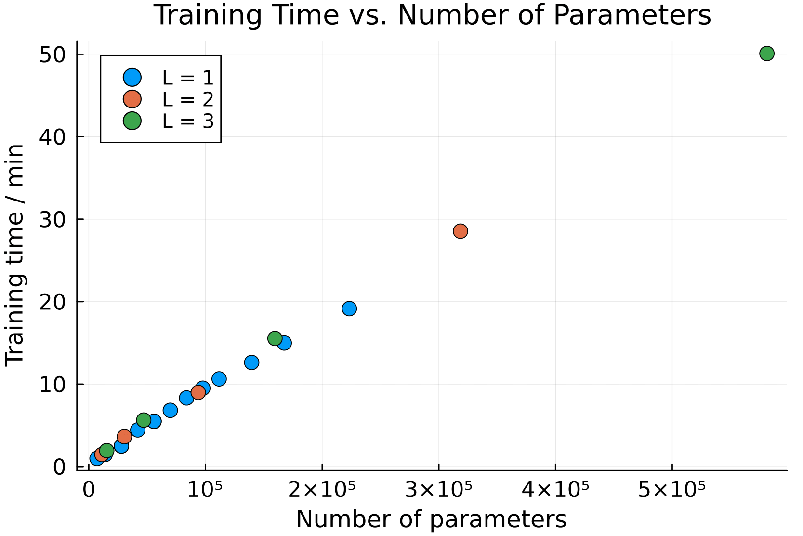
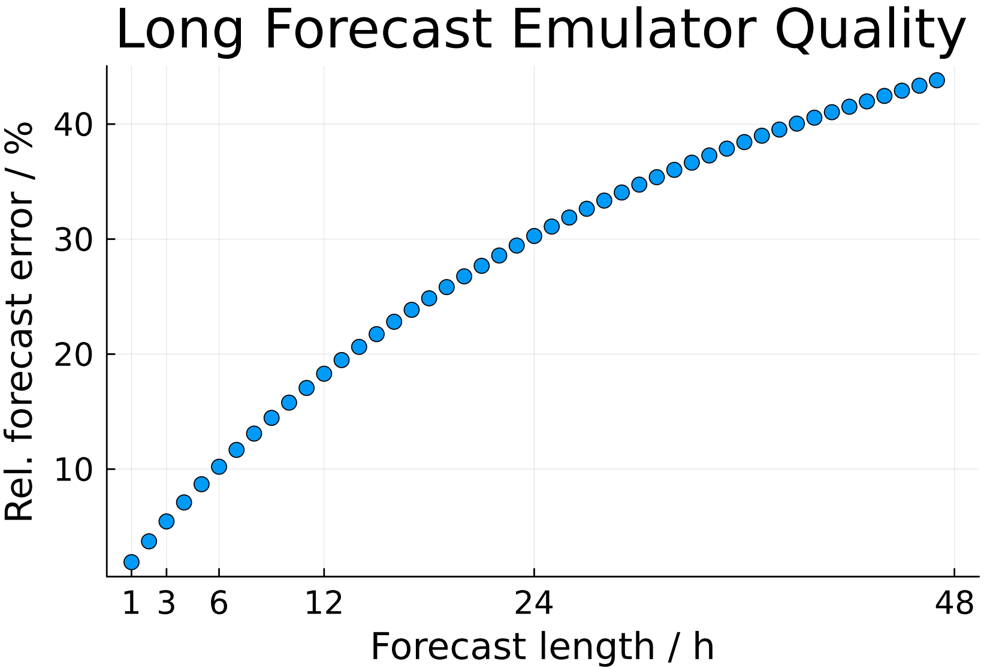
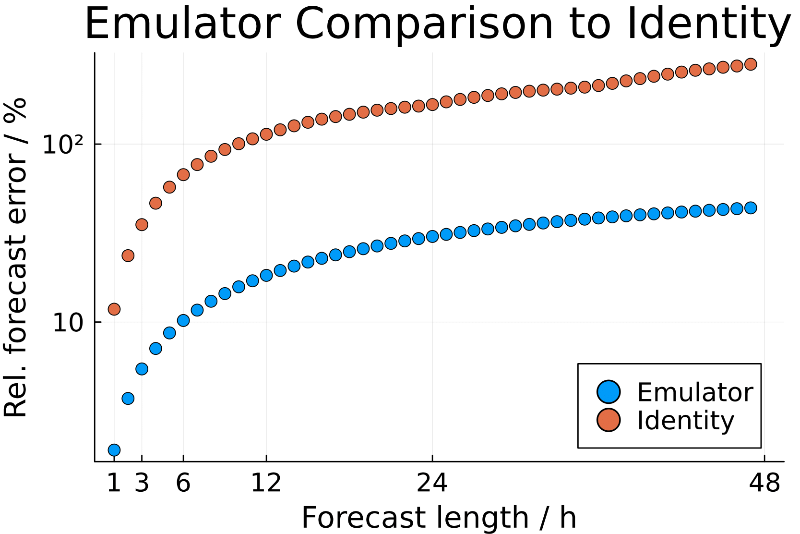
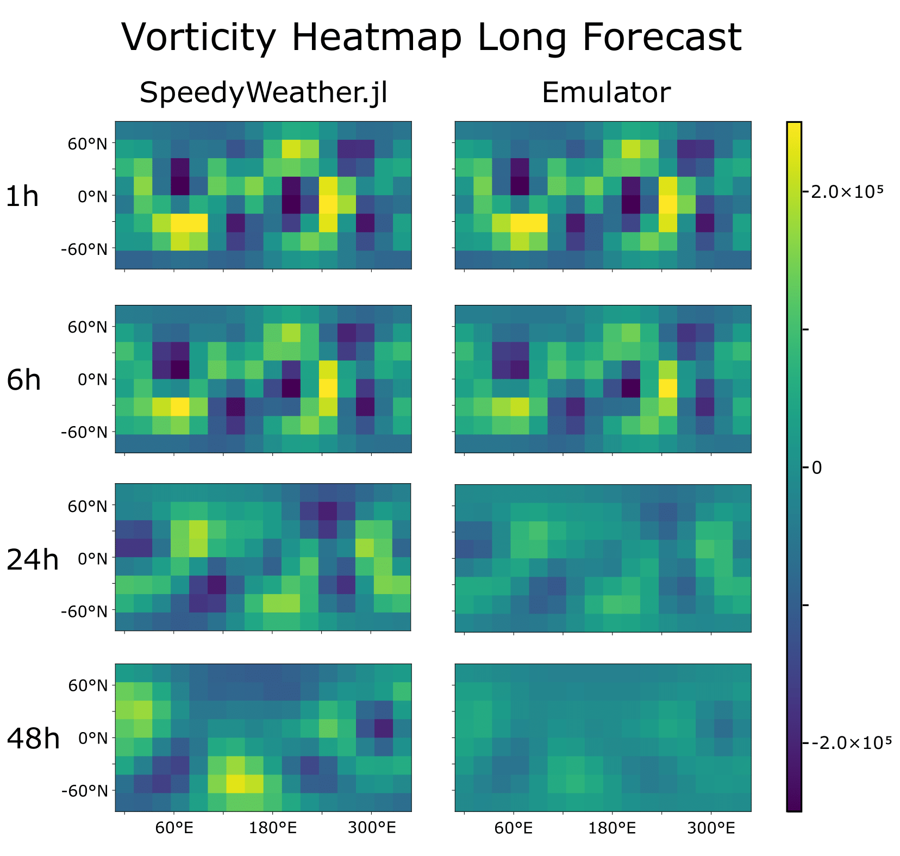
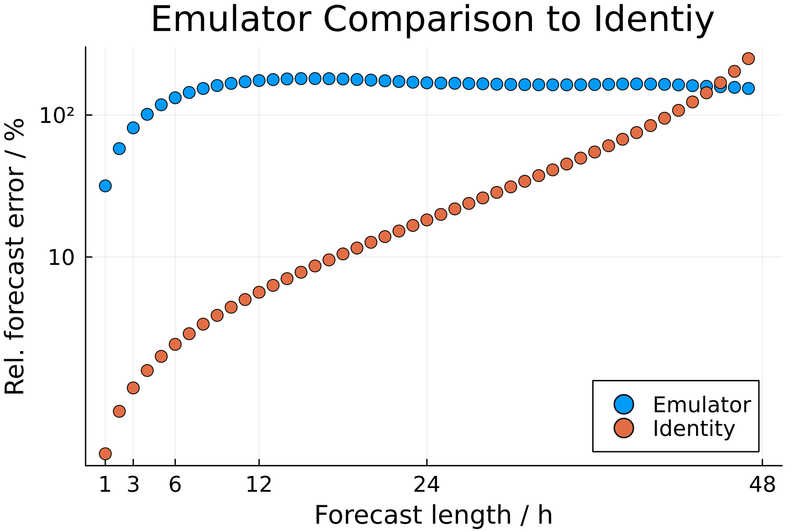
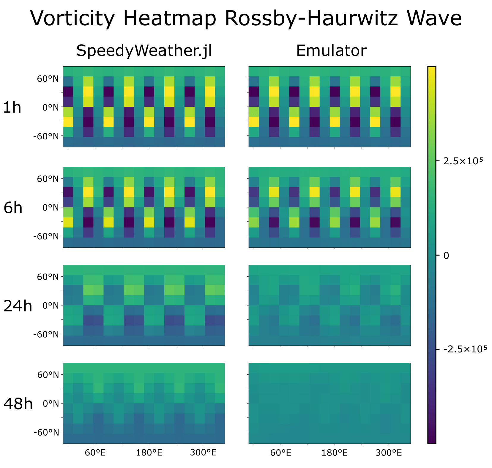

# Examples

This section provides explanation of code used to produce the results presented in the project report, along with additional examples and outputs. The plotting routines themselves are not listed here, but interested readers can find the corresponding code under the folder [`examples`](https://github.com/SieglStefan/SpeedyWeatherEmulator.jl/tree/main/examples) in the repository. In addition, the actual code is structured somewhat differently (e.g., the separation into performance and evaluation parts) from the simplified demonstrations shown in this documentation. Nevertheless, the scripts are extensively commented, making them straightforward to follow.


The [Project Report](https://github.com/SieglStefan/SpeedyWeatherEmulator.jl/blob/main/ProjectReport.pdf) provides a quick overview of the examples without code snippets. Furthermore, it briefly introduces the necessity and background of emulators and explains and discusses the results, which is not done here.


## Hyperparameter Optimization
First, a hyperparameter optimization (width and depth of the neural network) is performed, consisting of a coarse and fine optimization.


### Data Generation
For this purpose, the simulation parameters `sim_para` are defined, raw data is generated and stored, and the corresponding simulation data `sim_data` produced and saved. In all subsequent examples, these `sim_data` is used directly, so the raw data is no longer required and can be deleted if desired (e.g. storage reasons). The data is then further formatted into data pairs:

```julia
# Define simulation parameters
const TRUNC = 5
const N_DATA = 48
const N_IC = 1000

sim_para = SimPara(trunc=TRUNC, n_data=N_DATA, n_ic=N_IC)

# Generate raw data
generate_raw_data(sim_para)

# Generate simulation data and save it
sim_data = SimData(sim_para)
save_data(sim_data)

# Generate formatted data
fd = FormattedData(sim_data)
```

### Coarse Optimization

We first perform a coarse optimization using the following values for depth (L) and width (W):

```julia
L_list_coarse = [1,2,3]                 # depth: number of hidden layers
W_list_coarse = [64, 128, 256, 512]     # width: number of neurons per hidden layer
```

Next, we run a short and simple initial training using `nn_warmup` to ensure that the time logging is not distorted:

```julia
nn_warmup = NeuralNetwork(io_dim=2*calc_n_coeff(trunc=TRUNC),
                          hidden_dim=8,
                          n_hidden=1)

_, _ = train_emulator(nn_warmup, fd; n_epochs=1)
```

After this initial warm-up, we are now ready to train the emulators for the different depths and widths. A total of 12 combinations are tested. This is computationally intensive and may take several hours on simple standard machines. Therefore, the emulators and losses are also saved for later use, so that the optimization does not need to be repeated.

```julia
# Training loop
for L in L_list_coarse, W in W_list_coarse

    # Define simulation parameters for specific hyperparameter
    id = "_hyperpara_L$(L)_W$(W)"
    sim_para = SimPara(trunc=TRUNC, n_data=N_DATA, n_ic=N_IC, id_key=id)

    # Define neural network and train the emulator
    nn = NeuralNetwork( io_dim=2*calc_n_coeff(trunc=TRUNC),
                        hidden_dim = W,
                        n_hidden = L)

    em, losses = train_emulator(nn, fd; sim_para=sim_para)

    # Save losses and data for later evaluation
    save_data(em)
    save_data(losses)
end
```

Next, we define a function `n_params` to calculate the total number of parameters of a neural network. In addition, we define a dictionary `plot_data` to conveniently store plotting data for different (L, W) combinations:

```julia
n_params(d, W, L) = (d*W + W) + (L-1)*(W*W + W) + (W*d + d)

plot_data = Dict{Tuple{Int,Int}, NamedTuple}()      
```

Next, we want to populate the dictionary with the relative errors for various forecast times (horizons) and the total number of parameters for all (L,W) combinations:


```julia
# Define comparing time horizons
horizons = [1, 6, 12, 24]

# Fill the plot data dict. for all coarse hyperparameter
for L in L_list_coarse, W in W_list_coarse

    # Define simulation parameters for specific hyperparameter for leading specific emulator
    id = "_hyperpara_L$(L)_W$(W)"
    sim_para = SimPara(trunc=TRUNC, n_data=N_DATA, n_ic=N_IC, id_key=id)

    # Load the specific emulator (generated by training loop above)
    em = load_data(Emulator, sim_para)

    # Define container for rel. errors for different horizons
    err_vec = zeros(N_DATA)

    # Compare the emulator for different horizons
    for steps in horizons
        err_vec[steps] = compare_emulator(  em,
                                            x_test=fd.data_pairs.x_valid,
                                            y_test=fd.data_pairs.y_valid,
                                            n_it=steps)

    end

    # Fill the dict
    plot_data[(L,W)] = (err=err_vec, params=n_params(2*calc_n_coeff(trunc=TRUNC), W, L))
end
```

These results are then plotted:



The code for generating the plots can be found in the package repository.


### Fine Optimization

Next, a finer optimization is performed around the best value from the coarse search (L = 1, W = 512) using the following values:

```julia
L_list_fine = [1]                           # depth: number of hidden layers
W_list_fine = [384, 512, 640, 768, 896, 
                1024, 1280, 1536, 2048]     # width: number of neurons per hidden layer
```

The procedure is very similar and is not repeated here. Interested readers can find the details in the repository. The results are plotted again:



For later applications, the combination (L = 1, W = 640) is chosen as the best parameters, as it provides the best compromise between emulator quality and training time. This combination is also the default for the `NeuralNetwork` object.


### Parameters vs. Time

In the plots above, emulator quality was shown against the total number of parameters of the neural network. This raises the further question of how the different (L, W) combinations perform in terms of time. A good emulator should provide high prediction quality but should also not take excessively long to train. How, then, are training time and parameter count related? To investigate this, training time versus parameter count is plotted:



A clear linear correlation can be observed. Training time and parameter count are therefore essentially synonymous. The corresponding code is again available in the repository.


## Long Forecast Quality
Next, the prediction quality for different forecast lengths is examined in more detail. For this purpose, we use the simulation data generated during the [Hyperparameter Optimization](#hyperparameter-optimization) by loading the stored data and subsequently formatting them:

```julia
# Load and format simulation data, generated by the hyperparameter optimization
const TRUNC = 5
const N_DATA = 48
const N_IC = 1000

sim_para_loading = SimPara(trunc=TRUNC, n_data=N_DATA, n_ic=N_IC)
sim_data = load_data(SimData, sim_para_loading)
fd = FormattedData(sim_data)
```

Next, the best emulator from the hyperparameter optimization (L = 1, W = 640) is loaded. For this purpose, a `separate sim_para_emulator` must be defined:

```julia
# Loading the best emulator from the hyperparameter optimiaztion
sim_para_emulator = SimPara(trunc=TRUNC, n_data=N_DATA, n_ic=N_IC, id_key="_hyperpara_L1_W640")
em = load_data(Emulator, sim_para_emulator)
```

Then, the data vectors `err_vec` and `err_vec0` storing rel. errors are defined. `err_vor` simply contains the averaged relative error of the emulator for different horizons, while `err_vor0` contains the averaged relative error of the identity emulator. Thus, err_vec0 represents the relative error between $\mathrm{vor}(t + \mathrm{steps})$ and $\mathrm{vor}(t)$ as a measure of the actual change in vorticity for comparison.

```julia
# Calculate the rel. errors 
for steps in 1:N_DATA
    err_vec[steps] = compare_emulator(  em,
                                        x_test=fd.data_pairs.x_test,
                                        y_test=fd.data_pairs.y_test,
                                        n_it=steps)
    err_vec0[steps] = compare_emulator( em,
                                        x_test=fd.data_pairs.x_test,
                                        y_test=fd.data_pairs.y_test,
                                        n_it=steps,
                                        id_em=true)     # identy emulator (em(vor) = vor)
end
```

Different values for the maximum forecast length (here `N_DATA`) can of course also be used. This data is now plotted again:





For further details, see the repository and/or project report. 

### Heatmap Plots
Next, we create a visual representation of emulator quality using `plot_heatmap`. To this end, we select the forecast horizons to be plotted and extract corresponding vorticity vectors by specifying the index of the initial condition `ic`.

```julia
# Define the time horizons for comparison and used initial condition
horizons = [1, 6, 24, 48]
ic = 6
```

(Here, ic = 6 was chosen because its vorticity vectors produce clear plots.) We then compute the target and emulated vorticity step by step and plot the corresponding heatmaps:

```julia
# Loop for different time horizons
for h in horizons
    # Initial vorticity
    vor0 = sim_data.data[:, 1, ic]

    # Target (SpeedyWeather.jl) and emulated vorticity
    vor_sw = sim_data.data[:, h, ic]
    vor_em = vor0

    for _ in 1:h
        vor_em = em(vor_em)
    end

    # Create heatmap plots
    colorrange = (-2.5e-5, +2.5e-5)
    fig_sw = plot_heatmap(vor_sw, trunc=5, title="", range=colorrange)
    fig_em = plot_heatmap(vor_em, trunc=5, title="", range=colorrange)
end
```

This results in many individual heatmaps. These heatmaps are not shown here but were subsequently combined into a single large figure using Inkscape:



For further details, see the repository and/or project report. 


## Rossby-Haurwitz wave
So far, the emulator has only been tested on random initial conditions, i.e., on data with the same structure it was trained on. We now want to examine how the emulator responds to special cases. For this purpose, we consider the Rossby–Haurwitz wave, which propagates steadily around the Earth. Thus, we define the Rossby–Haurwitz initial state as the initial condition:


```julia
# Define Rossby-Haurwitz wave initial condiion
m = 4
ω = 7.848e-6
K = 7.848e-6

ζ(λ, θ, σ) = 2ω*sind(θ) - K*sind(θ)*cosd(θ)^m*(m^2 + 3m + 2)*cosd(m*λ)
```

This code snippet was taken from the documentation of `SpeedyWeatherEmulator.jl`, which in turn refers to the paper ‘A standard test set for numerical approximations to the shallow water equations in spherical geometry’ by David L. Williamson, John B. Drake, James J. Hack, Rüdiger Jakob, and Paul N. Swarztrauber. See the project report for details on references.

With this initial condition defined, we can now generate simulation data for comparison. To do so, the initial condition must be passed to `SimPara`, which then forwards it to `generate_raw_data`, where `SpeedyWeather.jl` uses it to generate data. Subsequently, the data is formatted again. Since we only require test data, the splits are set to `splits = (0, 0, 1)`:


```julia
# Define test data
sim_para_RH = SimPara(trunc=5, n_data=48, n_ic=1, initial_cond=ζ, id_key="_RH_wave", n_spinup=0)
generate_raw_data(sim_para_RH)
sim_data_RH = SimData(sim_para_RH)
fd_RH = FormattedData(sim_data_RH, splits=(train=0, valid=0, test=1))
```

The subsequent procedure is analogous to [Long Forecast Quality](#Long-Forecast-Quality). An emulator is loaded, the relative errors are computed, and the data is plotted. See the repository and/or project report for details. The resulting plots are shown below:




