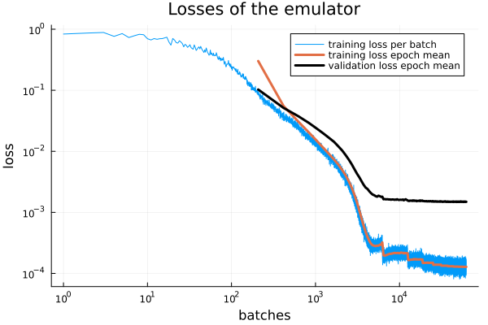
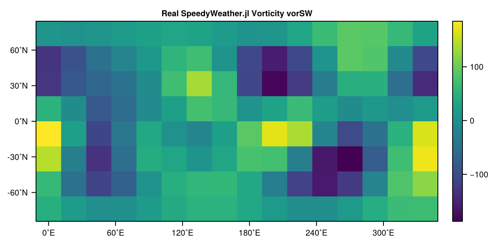

# Running SpeedyWeatherEmulator.jl

This section introduces the core functionality of the package.  
After a short review of the basic workflow of the package it provides a step-by-step overview of how to generate simulation data, format it for training, build and train an emulator, saving/loading data, and evaluate its performance.


## Basic workflow

This brief introduction to the workflow is meant to illustrate how the different steps, functions, and data types of the package interact. I have deliberately omitted details such as additional functions, parameters, or default values. These can be found in the sections below or seen in action in the examples.

Every workflow in SpeedyWeatherEmulator.jl begins by defining the simulation parameters in a `SimPara` object. These parameters control the spectral truncation, the number of timesteps to be stored, the number of independent initial conditions and more:

```julia
sim_para = SimPara(trunc=5, n_data=20, n_ic=500)
```

With these parameters defined, raw vorticity data is generated using SpeedyWeather.jl and stored on disk.

```julia
generate_raw_data(sim_para)
```

The raw files are then loaded into a `SimData` container, which provides a consistent array layout. From this, formatted datasets are built, splitting the vorticity time series into train/validation/test pairs.

```julia
sim_data = SimData(sim_para)
fd = FormattedData(sim_data)
```

Next, we define a neural network architecture and train it on the formatted data. This produces both an `Emulator` (the trained model) and a `Losses` object that tracks training progress.

```julia
nn = NeuralNetwork()
em, losses = train_emulator(nn, fd)
```

After the training, the mean relative error and max relative error for one step are printed to STDOUT, e.g.:

```text
--------------------------------------
Mean relative error: 13.041 %
Max relative error:  62.957 %
--------------------------------------
```

The recorded losses can then be visualized:

```julia
display(plot_losses(losses))
```



Finally, we can directly compare emulator predictions with SpeedyWeather.jl outputs. Here we select one vorticity state (`vor0`), its SpeedyWeather forecast (`vorSW`), and the emulator’s prediction (`vorEM`) after three steps. 

```julia
vor0 = sim_data.data[:,10,500]
vorSW = sim_data.data[:,13,500]
vorEM = em(em(em(vor0)))
```

Each of them can be visualized as a heatmap,

```
plot_heatmap(vor0, trunc=5, title="Initial Vorticity vor0")
plot_heatmap(vorSW, trunc=5, title="Real SpeedyWeather.jl Vorticity vorSW")
plot_heatmap(vorEM, trunc=5, title="Predicted Emulator Vorticity vorEM")
```

resulting in:





The difference between the initial vorticity and the final vorticity is small, but it can be seen that the emulator already approximates the real SpeedyWeather.jl data reasonably well.


## Generating and formatting data
_Under Construction_

## Training
_Under Construction_

## Saving/Loading data
_Under Construction_

## Evaluation
_Under Construction_


