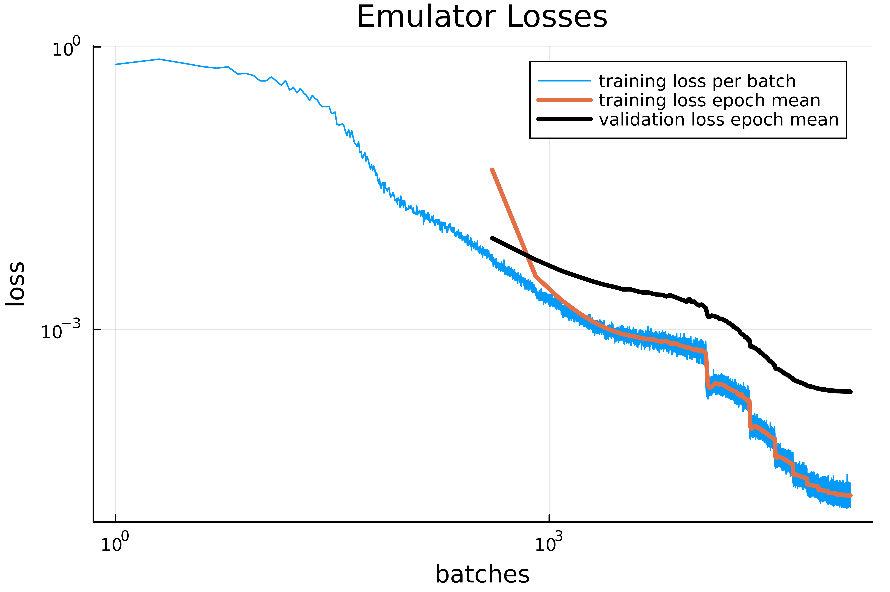
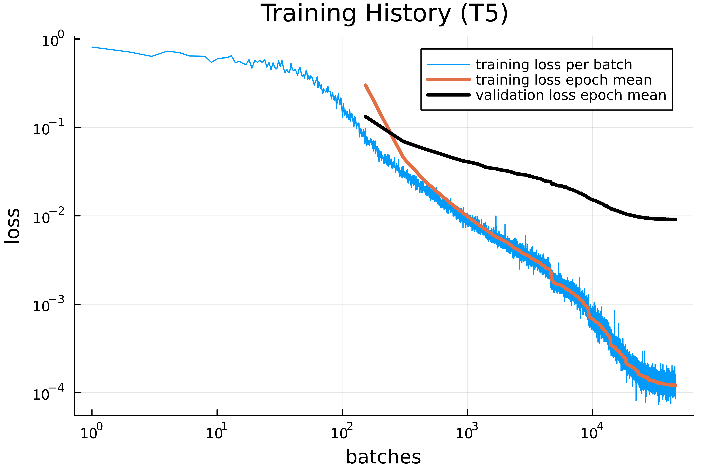
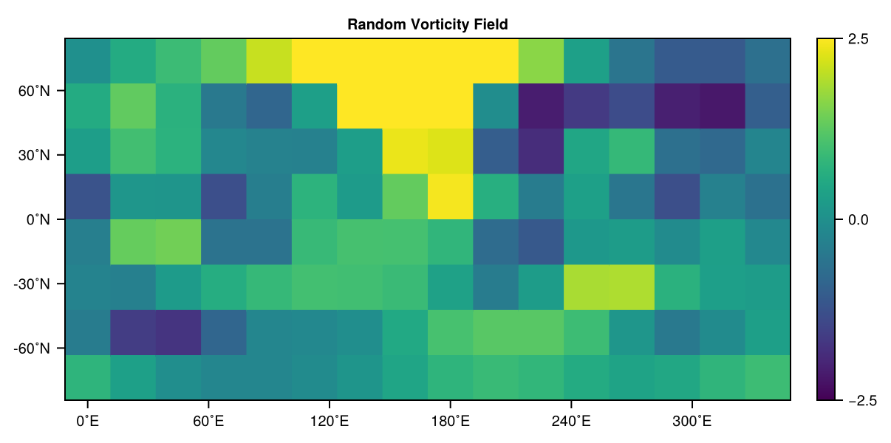
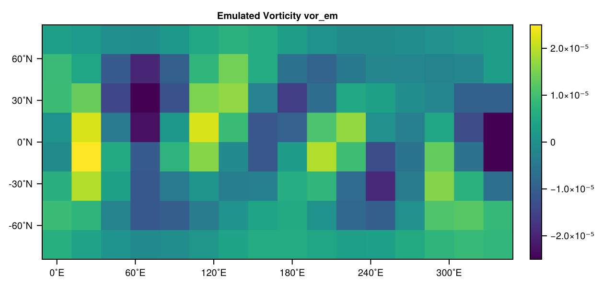
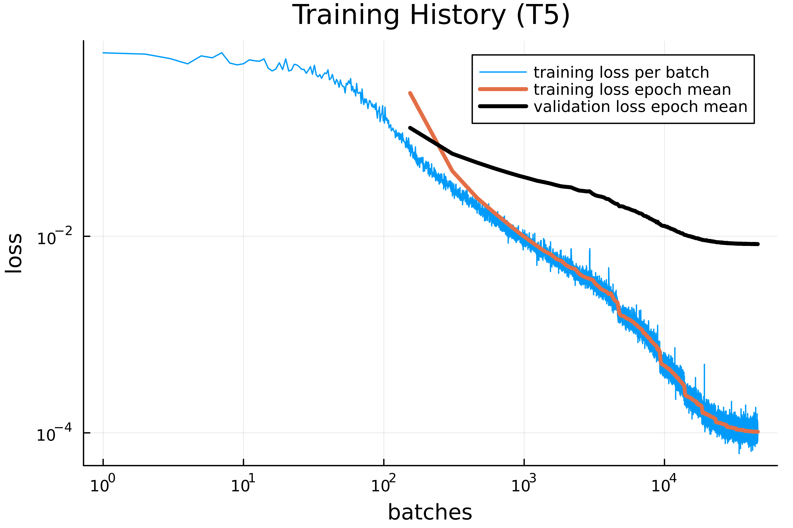

# Running SpeedyWeatherEmulator.jl

This section introduces the core functionality of the package.  
After a short review of the basic workflow of the package it provides a step-by-step overview of how to generate simulation data, format it for training, build and train an emulator, saving/loading data, and evaluate and its performance.

For the plots in this chapter, a separate, slightly modified script was used. If you are particularly interested in details, you can find the exact code used for plot creation in the repository: [plot_utils/docs_plots_running_SWE](https://github.com/SieglStefan/SpeedyWeatherEmulator.jl/tree/main/plot_utils/docs_plots_running_SWE)


## Basic Workflow

This brief introduction to the workflow is meant to illustrate how the different steps, functions, and data types of the package interact. I have deliberately omitted details such as additional functions, parameters, or default values. These can be found in the sections below, seen in action in the examples or looked up in the source code.

Every workflow in SpeedyWeatherEmulator.jl begins by defining the simulation parameters in a `SimPara` object. These parameters control the spectral truncation, the number of datapoints to be stored per i.c., the number of independent initial conditions and more:

```julia
sim_para = SimPara(trunc=5, n_data=24, n_ic=800, id_key="_basic_workflow")
```

With these parameters defined, raw vorticity data is generated using SpeedyWeather.jl and stored on disk.

```julia
generate_raw_data(sim_para)
```

The raw files are then loaded into a `SimData` container, which provides a consistent array layout. From this, formatted datasets are built, splitting the vorticity time series into train/validation/test pairs.

```julia
sim_data = SimData(sim_para)
fd = FormattedData(sim_data)
```

Next, a neural network architecture is defined and trained on the formatted data. This produces both an `Emulator` (the trained model) and a `Losses` object that tracks training progress.

```julia
nn = NeuralNetwork()
em, losses = train_emulator(nn, fd)
```

After the training, the mean relative error and max relative error for one step are printed to STDOUT:

```text
--------------------------------------
Mean relative error: 3.528 %
Max relative error:  6.673 %
--------------------------------------
```

The recorded losses can then be visualized:

```julia
plot_losses(losses)
```



Finally, we can visually compare emulator predictions with SpeedyWeather.jl outputs. Here we select one vorticity state (`vor0`), its SpeedyWeather forecast (`vorSW`), and the emulator’s prediction (`vorEM`) after six steps. This corresponds to a six hour forecast:

```julia
vor0 = fd.data_pairs.x_test[:,10,1]
vor_sw = fd.data_pairs.y_test[:,10+6,1]

# Calculate emulator vorticity
vor_em = vor0
for _ in 1:6
    global vor_em = em(vor_em)
end
```

Each of them can be visualized as a heatmap,

```
colorrange = (-2.5e-5, +2.5e-5)
plot_heatmap(vor0, trunc=5, title="Initial Vorticity vor0", range=colorrange)
plot_heatmap(vor_sw, trunc=5, title="Target Vorticity vor_sw", range=colorrange)
plot_heatmap(vor_em, trunc=5, title="Emulated Vorticity vor_em", range=colorrange)
```

resulting in:







The difference between the initial vorticity and the final vorticity is small, but it can be seen that the emulator already approximates the real SpeedyWeather.jl data reasonably well.


## Generating and Formatting Data

Before training a neural network emulator, we need to generate and structure data.  
This process has three steps: defining the simulation parameters, running SpeedyWeather.jl to create raw data, and finally preparing formatted datasets for machine learning.

### Simulation Parameters
Every workflow begins by specifying the simulation setup in a `SimPara` object.  
This struct collects the essential parameters of a barotropic SpeedyWeather.jl simulation:

- the spectral truncation (`trunc`, e.g. T5),  
- the number of stored timesteps after spin-up (`n_data`),  
- the number of independent initial conditions (`n_ic`),  
- and additional metadata such as spin-up length, timestep size, or a unique `id_key`.

Together, these parameters determine both the structure of the generated data and the folder name under which it is stored. For example:

```julia
sim_para = SimPara(trunc=5, n_data=50, n_ic=200, id_key="_test1")
```

It should be emphasized once again that only the fields mentioned above are responsible for saving and loading data. In general, it is recommended not to rely solely on the identifiers `trunc`, `n_data`, and `n_ic`, but to always provide an additional `id_key` as well! See [Saving/Loading Data](#savingloading-data) for details.

Furthermore, there are additional simulation parameters with default values, summarized as follows:

```julia
SimPara{F}
├ trunc::Int
├ n_data::Int
├ n_ic::Int
├ n_spinup::Int = 9
├ t_step::Float32 = 1.0
├ initial_cond::F = nothing
└ id_key::String = ""
```

For example, a custom initial condition can be defined, or the time step can be adjusted.

### Generating Raw Data
With the simulation parameters defined, raw data can be generated directly from SpeedyWeather.jl:

```julia
generate_raw_data(sim_para; overwrite=true)
```

This command creates a folder with one subdirectory per initial condition and stores the corresponding raw simulation output. If raw data with the same simulation parameters already exist and `overwrite = false`, data generation is aborted.

Generating raw data can be slow and memory-intensive (few gigabytes), since not only vorticity but also other prognostic variables (output of diagnostic variables is disabled) are written to disk. It should therefore be used sparingly, ideally only when new datasets are absolutely required! Instead, it is strongly recommended to use `SimData` objects (few megabytes) as often as possible. Furthermore, problems may arise if one attempts to delete the raw data within the same session in which they were generated.

### Structured Simulation Data
In order to make use of raw data, it must be loaded into a `SimData` object, which is handled by a convenience constructor:

```julia
sim_data = SimData(sim_para)
```

The resulting tensor has dimensions $\text{data} \in \mathbb{R}^{(2 \cdot n_\text{coeff}) \times n_\text{data} \times n_\text{ic}}$ where real and imaginary parts of the spectral coefficients are stacked along the first axis.
This format is optimized for efficient slicing over time and initial conditions, and serves as the basis for all later steps. It also consumes significantly less memory than the previous raw data and can be easily handled using the methods from [Saving/Loading Data](#savingloading-data).

### Preparing Formatted Data
For machine learning, we need to turn the discrete time series into input–output pairs.
The `FormattedData` constructor automates this process by pairing consecutive timesteps:

```math
(x, y) = \bigl( \mathrm{vor}(t), \, \mathrm{vor}(t + \Delta t) \bigr)
```

Then it splits the dataset into training, validation, and test sets. By default, the split is 70 % training, 15 % validation, and 15 % test:

```julia
fd = FormattedData(sim_data)    # results in splits=(train=0.7, valid=0.15, test=0.15)
```

However, arbitrary alternative splits can also be used. The convenience constructor internally handles non-unique splits by normalization:

```julia
fd = FormattedData(sim_data,  splits=(train=100, valid=50, test=50))    # results in splits=(train=0.5, valid=0.25, test=0.25)
```
Since the targets are shifted forward in time, the total number of datapairs available is `(n_data − 1) * n_ic`.


## Training
Once the data pipeline is established, we can train a neural network to emulate the barotropic SpeedyWeather.jl model.  
This involves defining an architecture, normalizing the data, building an emulator, training it on input–output pairs, and finally comparing predictions against reference data.

### Neural Network Architecture
The emulator uses a simple feed-forward neural network with ReLU activations.  
The architecture is described by a `NeuralNetwork` object, which specifies the input/output dimension, the hidden layer dimension (width), and the number of hidden layers (depth).

```julia
nn = NeuralNetwork(io_dim=54, hidden_dim=128, n_hidden=2)
```

This compact container makes it easy to experiment with different model sizes without touching the actual Flux code. 

### Normalizsation by Z-Score
Since the spectral coefficients have different orders of magnitude, each of them are seperately normalized before training using a Z-score transformation:

```math
z_i = \frac{x_i - \mu_i}{\sigma_i},
```

where $\mu_i$ is the mean and $\sigma_i$ the standard deviation of the ith spectral coefficient in the training set. 
This is achieved with a `ZscorePara` struct, which stores the mean and standard deviation of the training set. Normalization is always based only on the training data to avoid information leakage.
The emulator applies this transformation automatically when called.

### The Emulator Wrapper
The Emulator struct 

```julia
Emulator{F, A<:AbstractVector{Float32}}
├ sim_para::SimPara{F}
├ chain::Flux.Chain
└ zscore_para::ZscorePara{A}
```

bundles three pieces of information:

- the simulation parameters of the dataset,
- the neural network chain built from Flux,
- the Z-score normalization parameters.

This design keeps the metadata and the trained model tightly coupled. 
For convenience, an emulator can be used like a function:

```julia
y_pred = em(x)
```
where `x` is a spectral coefficient tensor at time `t` and the output is the emulator prediction at `t + Δt`. The first dimension of `x` must equal the input/output dimension of the `NeuralNetwork` of `em()`. 

Furthermore, `Emulator` automatically handles moving data to the GPU (if available) and back to the CPU.

### Logging Training Progress
During training, losses are automatically collected in a `Losses` object.
It stores the mean-squared errors for each batch of the training and validation sets, and also the time used for training (`training_time`) in seconds. 
This makes it straightforward to plot learning curves and diagnose overfitting.

### Training the Emulator
The central routine is `train_emulator`, which orchestrates the entire process:

1. Compute Z-score parameters from the training set.
2. Build an `Emulator` according to the chosen architecture.
3. Normalize training and validation data.
4. Train with the Adam optimizer, starting with a given learning rate that halves every 30 epochs.
5. Record training and validation losses batch-by-batch.
6. Reinitializes the `Losses` object with the needed training time
7. Evaluate the trained emulator on the test set.

At the end, `train_emulator` prints rel. error statistics of the test set to `STDOUT`:

```text
--------------------------------------
Mean relative error: 13.041 %
Max relative error:  62.957 %
--------------------------------------
```


and returns both the trained emulator and its recorded loss history with training time.

A typical training run looks like this:

```julia
em, losses = train_emulator(nn, fd; batchsize=64, n_epochs=100, η0=0.0005)
```

Training times should be treated with caution. In order to compare the training times of different hyperparameters, a warm-up training must first be performed, since the initial training always takes longer.

### Evaluating Accurarcy
To quantify performance, the function `compare_emulator` applies the trained model to unseen test inputs and compares the predictions against SpeedyWeather.jl reference outputs.
It optionally reports mean and maximum relative errors in percent, and can optionally display the error of each spectral coefficient separately.
The function also returns the overall average error, which is useful for automated evaluation. 
`compare_emulator` is also used in `train_emulator` on the test set.

```julia
compare_emulator(em; 
    x_test=fd.data_pairs.x_test,
    y_test=fd.data_pairs.y_test,
    all_coeff=true,
    output=true)
```

`compare_emulator` can also be used to compare multiple emulator steps (rollouts) by specifying the argument `n_it`:

```julia
compare_emulator(em; 
    x_test=fd.data_pairs.x_test,
    y_test=fd.data_pairs.y_test,
    n_it = 3)   # corresponds to the comp. of em(em(em()))
```

## Saving/Loading Data

Training an emulator often requires repeating experiments with different network architectures or datasets.  
To make results reproducible and avoid re-running costly simulations, SpeedyWeatherEmulator.jl provides simple functions for saving and reloading data containers using JLD2.

### Unified File Paths
All saved objects — whether `SimData`, `Emulator`, or `Losses` — are uniquely identified by their simulation parameters (`SimPara`).
The helper functions `data_path` and `delete_data` ensure that every dataset receives a consistent folder or file name:

- Raw data are stored in dedicated folders with one subfolder per run.  
- All other types (`SimData`, `Emulator`, `Losses`) are saved as single `.jld2` files.

The file name includes truncation, number of timesteps, number of initial conditions, and the optional `id_key`, e.g.

```text
data/sim_data/sim_data_T5_ndata50_IC200_ID_demo.jld2
```

In general, it is recommended not to rely solely on the identifiers `trunc`, `n_data`, and `n_ic`, but to always provide an additional `id_key` as well!


### Saving Data
Any supported container (`SimData`, `Emulator` or `Losses`) can be saved with a single call:

```julia
save_data(sim_data)
save_data(emu; overwrite=true)
```

In the second case existing data will be overwritten. By default, all data are stored in

```julia
SpeedyWeatherEmulator.jl/data
├ emulator
├ losses
└ sim_data
   └ sim_data_T5_ndata50_IC200_ID_demo.jld2
```

where `sim_data_T5_ndata50_IC200_ID_demo.jld2` is an example of an stored `SimData` object.

It is also possible to specify a custom path:

```julia
save_data(sim_data, path = myPath)
```

If data with the same simulation parameters already exist and `overwrite = false` (default), saving is aborted.
No functions were defined for directly saving and loading raw data, since the storage structure is more complex than that of JLD2. However, this is not really necessary due to the existence of `SimData`.


### Loading Data
Previously saved objects can be reloaded at any time:

```julia
sim_data_loaded = load_data(SimData, sim_para)
em_loaded      = load_data(Emulator, sim_para)
```

Here, the first argument specifies the object type to be loaded, and sim_para serves as the identifier of which one. A custom path can also be chosen again with `path = myPath`, from which the data will be loaded.


The function returns the object in its original type, making it seamless to continue training, evaluate a stored emulator, or plot old loss curves.


## Visualization

After training an emulator, it is often useful to visualize its performance and inspect vorticity heatmaps.  
SpeedyWeatherEmulator.jl provides a small set of plotting functions for these purposes.  
The plotting routines are intentionally kept simple: apart from an optional `title`, almost no additional styling parameters are exposed, in order to keep the interface clear and focused.

### Loss Curves
The function `plot_losses` visualizes the training history stored in a `Losses` object.  
It displays:

1. the raw training loss per batch (log–log scale),  
2. the mean training loss per epoch,  
3. the mean validation loss per epoch.  

This makes it easy to diagnose whether the network is converging properly and whether overfitting occurs.

```julia
plot_losses(losses; title="Training History (T5)")
```



The number of epochs is inferred automatically from the batch size and dataset split.
The returned plot object can be further customized or saved using the standard Plots.jl interface.

### Vorticity Heatmaps
To inspect actual states of the barotropic model, the function `plot_heatmap` reconstructs a vorticity field from a spectral coefficient vector and shows it as a heatmap.
This requires specifying the spectral truncation to interpret the coefficient layout correctly. With the argument `range = (a, b)` the color range of the heatmap can be adjusted:

```julia
vec = rand(Float32, 54)     # random coeffs for trunc=5
plot_heatmap(vec; trunc=5, title="Random Vorticity Field", range=(-2.5,+2.5))
```


Internally, the coefficients are converted into a lower-triangular matrix and then transformed into a physical-space grid.
The resulting heatmap provides an intuitive view of the spatial vorticity pattern represented by the spectral state. 